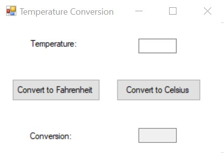

# Temperature Conversion

Create an application that allows the user to enter a temperature. The application should have a button that reads Convert to Fahrenheit. If the user clicks this button, the application should treat the temperature that is entered as a Celsius temperature and convert it to Fahrenheit.
It should also have a button that reads Convert to Celsius. If the user clicks this button, the application should treat the temperature as a Fahrenheit temperature and convert it to Celsius.
